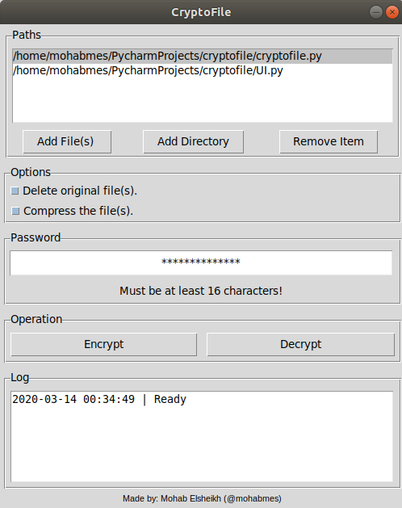

# CryptoFile
Encrypt\Decrypt file(s) using Advanced Encryption Standard [(AES)](https://en.wikipedia.org/wiki/Advanced_Encryption_Standard).

## Description
A personal tool I made to encrypt\Decrypt multiple files at once using [Python Cryptography Toolkit (pycrypto)](https://github.com/dlitz/pycrypto).

## Screenshot

